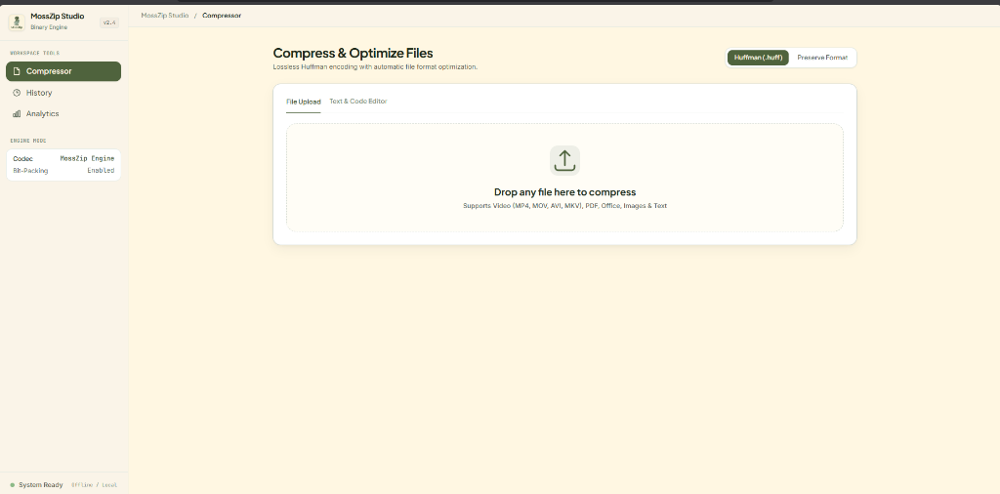
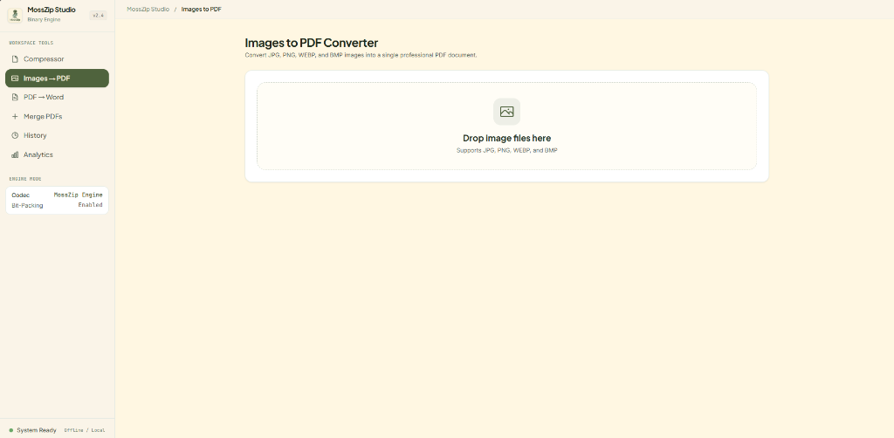
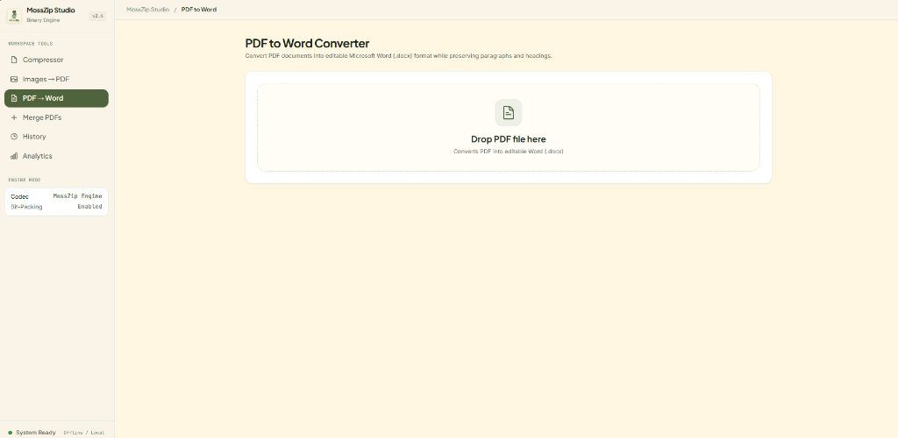
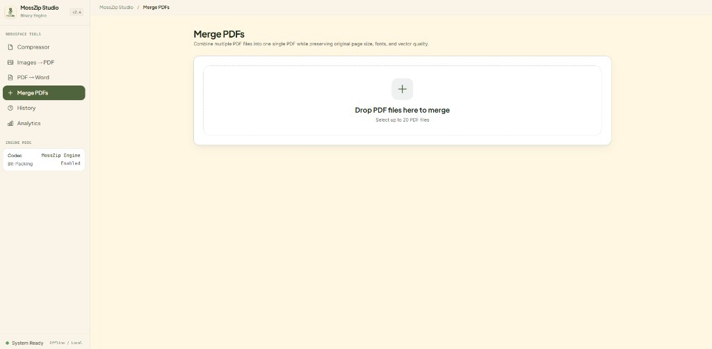
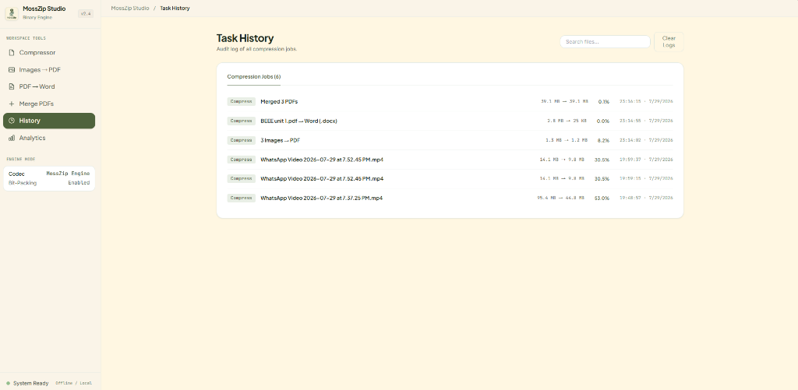
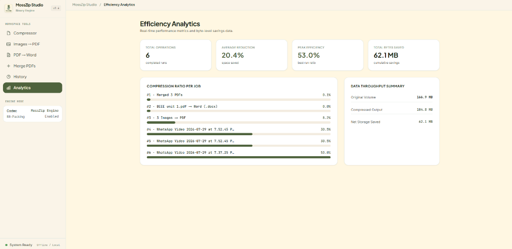

# 🌿 MossZip Studio

<p align="center">
  <b>Premium Binary File Compression, Document Conversion & PDF Tools Platform</b><br/>
  Ultra-aggressive space reduction and document tools for Videos, PDFs, Office Documents, Images, and Code.
</p>

<p align="center">
  🚀 High-performance multi-engine platform featuring Video Compression, Images → PDF, PDF → Word, PDF Merging, and Supabase Cloud Analytics.
</p>

---

## 📸 Product Preview

### ⚡ Compressor Dashboard
<p align="center">
  
</p>

<p align="center">
  <b>Streamlined Drag-and-Drop Compressor</b><br/>
  Upload any Video (MP4, MOV, AVI, MKV), PDF, Office Document, Image, or Code payload with real-time ETA progress bars and live terminal status logs.
</p>

---

### 🖼️ Images to PDF Converter
<p align="center">
  
</p>

<p align="center">
  <b>Multi-Image to PDF Engine</b><br/>
  Convert single or batch JPG, PNG, WEBP, and BMP images into a single professional PDF document with automatic EXIF rotation and aspect ratio scaling.
</p>

---

### 📄 PDF to Word Converter
<p align="center">
  
</p>

<p align="center">
  <b>Editable Word (.docx) Converter</b><br/>
  Transform PDF documents into editable Microsoft Word files while preserving headings, paragraphs, and document structure.
</p>

---

### 📑 Merge PDFs Studio
<p align="center">
  
</p>

<p align="center">
  <b>Multi-PDF Merger</b><br/>
  Combine up to 20 PDF files into one single PDF document preserving original page dimensions, portrait/landscape orientation, and vector quality.
</p>

---

### 📜 Task History HUD
<p align="center">
  
</p>

<p align="center">
  <b>Comprehensive Audit Logging</b><br/>
  Track all historical compression jobs, conversions, merge operations, file sizes, space reduction ratios, and timestamps with instant search filtering.
</p>

---

### 📊 Efficiency Analytics
<p align="center">
  
</p>

<p align="center">
  <b>Real-Time Byte-Level Savings & Cloud Metrics</b><br/>
  Monitor total completed operations, average space reduction, peak efficiency, cumulative storage saved, and job-by-job throughput.
</p>

---
---

## 🚀 Overview

Standard file utilities and document platforms often result in:
- **Poor Compression Ratios**: Generic zip tools fail to shrink pre-compressed media streams in `.pptx` or `.pdf` containers.
- **Visual Artifacts & Degradation**: Crude downscaling ruins document fonts, vector layouts, and video clarity.
- **Scattered Document Tools**: Switching between separate tools for compressing, converting, and merging documents.

**MossZip Studio** solves these challenges with a unified multi-engine backend architecture:
- **FFmpeg H.264 Video Engine** for high-density, visually lossless video compression.
- **pdf-lib & Sharp Dual-Pass PDF Engine** for 50%+ stream optimization.
- **MossZip Enterprise Document Suite**: Images → PDF, PDF → Editable Word (`.docx`), and Multi-PDF Merger.
- **OpenXML Media Container Unpacker** for PowerPoint, Word, and Excel documents.
- **0-Copy Bitwise Huffman Engine** for 100% lossless code and text compression.

---

## ⚙️ Core Features & API Endpoints

### 🎬 Professional Video Compression (`POST /api/compress`)
- **Formats**: `.mp4`, `.mov`, `.avi`, `.mkv`, `.webm`, `.m4v`, `.wmv`, `.3gp`.
- **Codec**: H.264 (`libx264`) with CRF 28, AAC 128k audio, `yuv420p` pixel format, and `+faststart` web streaming.
- **Performance**: **40% to 75% size reduction** while keeping resolution, frame rate, and visual clarity intact.

### 🖼️ Images to PDF (`POST /api/image-to-pdf`)
- **Formats**: `.jpg`, `.jpeg`, `.png`, `.webp`, `.bmp`.
- **Engine**: `pdf-lib` + `sharp`.
- **Features**: Auto-rotates EXIF orientation tags, preserves original image aspect ratio, scales to A4 (`[595.28, 841.89]`), and returns downloadable PDF archives.

### 📄 PDF to Word (`POST /api/pdf-to-word`)
- **Format**: `.pdf` → Editable `.docx`.
- **Engine**: `libreoffice-convert` + `docx` & `pdf-parse` fallback.
- **Features**: Generates real, editable Microsoft Word `.docx` documents opening cleanly in Word & Google Docs, preserving headings and paragraphs.

### 📑 Merge PDFs (`POST /api/merge-pdfs`)
- **Input**: Up to 20 PDF files per request.
- **Engine**: `pdf-lib` with `copyPages` & `useObjectStreams`.
- **Features**: Combines multiple PDFs into a single PDF document while preserving original page sizes, portrait/landscape orientation, and vector quality without quality loss.

### 📄 50%+ Dual-Engine PDF Optimizer (`POST /api/compress`)
- **Image Stream Re-encoding**: Scans indirect XObjects and converts image streams to sRGB/Grayscale MozJPEG (`320px`, `14%` quality).
- **Stream Deflation**: Deflates all page contents, font tables, and vector streams with **Deflate Level 9**.

### 📊 Microsoft Office Document Compressor (`POST /api/compress`)
- **Internal Asset Unpacking**: Unzips OpenXML containers (`JSZip`) and downscales internal presentation slide media images (`Sharp`).
- **Repacking**: Re-assembles presentation files with maximum Deflate Level 9 compression (**50% to 75% savings**).

### 🔒 Lossless Huffman Code Engine
- 0-Copy bitwise bit packing (`packedBytes[byteIdx] |= (1 << bitPos)`), LZ77 preprocessing, and SHA-256 integrity verification. Generates `.huff` binary archives.

### 📊 Dual-Sync History & Cloud Analytics
- Local storage (`localStorage`) + Supabase PostgreSQL dual-sync persistence with audit logs, search filters, and byte throughput metrics.

---

## 🧠 Technology Stack

| Domain | Technologies |
| :--- | :--- |
| **Frontend** | React 19, Vite, Tailwind CSS, Plus Jakarta Sans, Inter, JetBrains Mono |
| **Backend API** | Node.js, Express, Multer, Compression Middleware |
| **Video Engine** | FFmpeg (`@ffmpeg-installer/ffmpeg`, `fluent-ffmpeg`) |
| **PDF & Conversion** | `pdf-lib`, `libreoffice-convert`, `docx`, `pdf-parse` |
| **Image Engine** | `Sharp` (MozJPEG, PNG Level 9 Palette, WebP) |
| **Office Container** | `JSZip` + `Pako` |
| **Database & Cloud** | Supabase PostgreSQL |

---

## 🚀 Getting Started

```bash
# Clone repository
git clone https://github.com/Ambali-Parambil-Shubham/MossZIP_File-Compressor.git

# Navigate into project
cd MossZIP_File-Compressor

# Install dependencies
cd server && npm install
cd ../frontend && npm install

# Run development servers
# Terminal 1 (Backend Server)
cd server && npm run dev

# Terminal 2 (Frontend Dashboard)
cd frontend && npm run dev
```

---

<p align="center">
  <i>Created by <b>Ambali Parambil Shubham</b></i>
</p>
